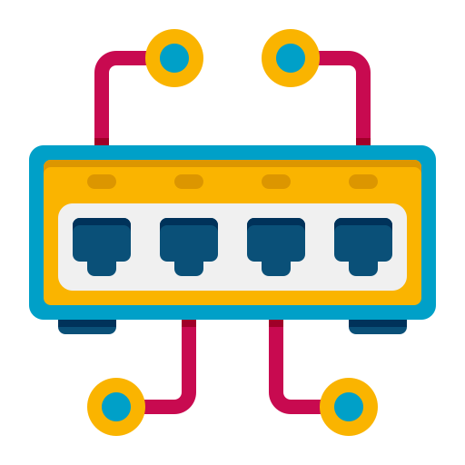

<p align="center">
  
</p>

<h1 align="center">Winchestack</h1>

<p align="center">
  Painel de monitoramento de acessos — quem está <strong>assistindo as câmeras</strong> e quem está <strong>na sua rede local</strong>, em tempo real.
</p>

<p align="center">
  
  
  
  
  
  
</p>

---

## Sobre

O **Winchestack** é um painel privado de observabilidade doméstica. Ele reúne, num só lugar,
duas perguntas do dia a dia:

- **Câmeras** — quantas pessoas estão assistindo cada câmera agora? (lê o relay de streaming do Watchtower)
- **Rede** — quais dispositivos estão conectados e ativos na minha rede local, por Wi-Fi ou cabo? (lê o roteador OpenWrt)

Interface separada para **desktop** e **mobile**, tema claro/escuro e atualização ao vivo.

## Recursos

- 🎥 **Espectadores das câmeras** em tempo real (com IP, navegador e dispositivo de cada um).
- 📡 **Dispositivos da rede**: nome, IP, MAC, tipo, conexão (Wi-Fi/cabo + sinal) e status online/ocioso.
- 📊 **Consumo de tráfego** por dispositivo (via `nlbwmon` no roteador).
- 🌗 Tema claro / escuro / sistema.
- 📱 UIs distintas para desktop e celular.
- 🔒 Acesso por **usuário único** (sem registro público).

## Stack

| Camada    | Tecnologia                                   |
| --------- | -------------------------------------------- |
| Backend   | Laravel 13, Fortify (auth por usuário)       |
| Frontend  | Inertia.js + Vue 3, Tailwind CSS v4, Lucide  |
| Banco     | PostgreSQL 16                                |
| Sessão/cache/fila | Redis 7                              |
| Dev infra | Docker Compose (Postgres + Redis)            |

## Requisitos

- PHP 8.3+ e Composer
- Node 20+ e npm
- Docker + Docker Compose

## Rodando local

```bash
# 1. Dependências
composer install
npm install

# 2. Ambiente
cp .env.example .env
php artisan key:generate

# 3. Banco + cache (Docker: Postgres :5433, Redis :6380)
docker compose up -d

# 4. Migrações + usuário admin (credenciais em .env: ADMIN_USERNAME / ADMIN_PASSWORD)
php artisan migrate --seed

# 5. Build do front e servir
npm run build
php artisan serve --port=8001
```

Acesse `http://localhost:8001` e entre com o usuário definido no `.env`.

> As portas 5433/6380 são propositais para o Winchestack conviver com o Watchtower
> na mesma máquina sem conflito.

Apelidos dos aparelhos da rede ficam em `config/network-labels.local.php`
(fora do git). Copie o exemplo:

```bash
cp config/network-labels.local.php.example config/network-labels.local.php
```

## Integrações

| Fonte                | Como                                                                 | Variáveis no `.env`                          |
| -------------------- | -------------------------------------------------------------------- | -------------------------------------------- |
| Espectadores câmeras | HTTP no relay do Watchtower (`/health` e `/viewers`)                 | `WATCHTOWER_RELAY_HEALTH_URL`                |
| Rede local           | SSH no roteador OpenWrt (`dhcp.leases`, `ip neigh`, `iwinfo`, `nlbw`) | `OPENWRT_HOST`, `OPENWRT_SSH_USER`, `OPENWRT_SSH_KEY` |

## Estrutura

```
app/
  Http/Controllers/MonitorController.php   # /api/viewers e /api/network
  Services/CameraViewersService.php        # lê o relay do watchtower
  Services/NetworkClientsService.php       # lê o roteador via SSH
resources/js/
  pages/Panel.vue                          # escolhe desktop x mobile
  components/desktop/DesktopPanel.vue
  components/mobile/MobilePanel.vue
  composables/{useMonitor,useDevice,useTheme}.js
config/winchestack.php                      # config das integrações
```

## Licença

Projeto privado. Todos os direitos reservados.
